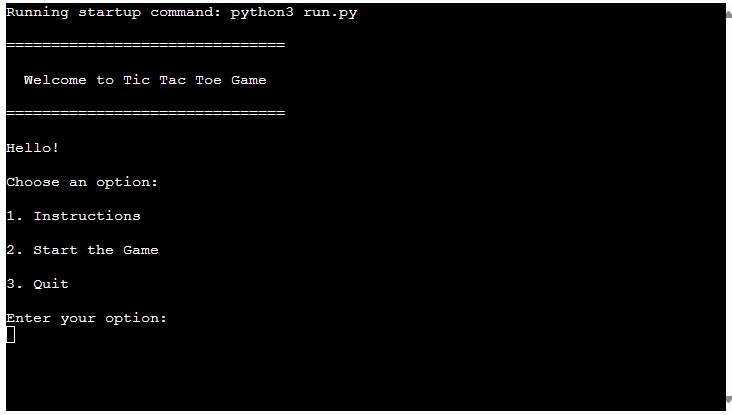
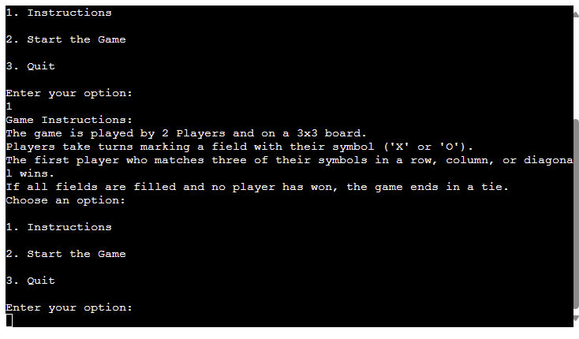
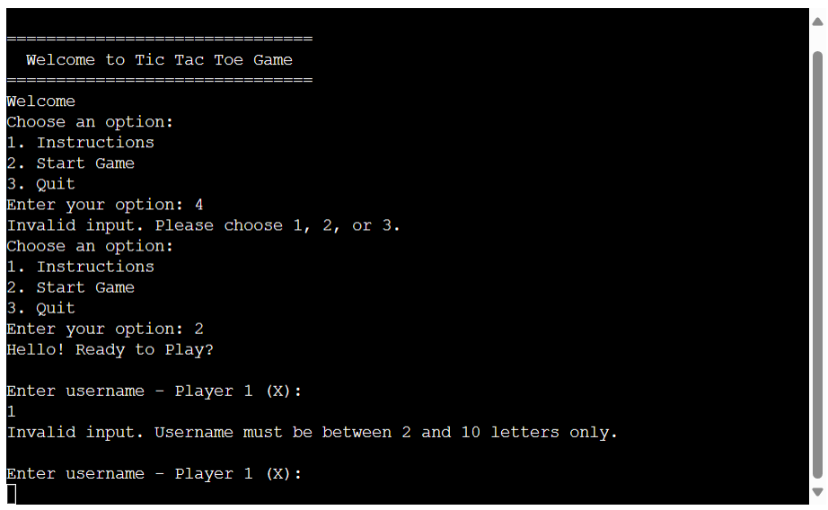

# Tic-Tac-Toe Game

Welcome to Tic-Tac-Toe Game ! It is a Python terminal game , which runs in Code Institute mock terminal on Heroku. It allows two players to play the classic game of Tic Tac Toe. Players can enter their usernames, where one will be assigned the symbol 'X' and the other 'O'. The program also provides warnings if the input is invalid.

The  live version of my project can be found under the following link [Tic Tac Toe](https://tic-tac-toe-2024-ec215a152e15.herokuapp.com/).

## How to Play
 + Run the Python script by clicking on 'Run the programm" button.
 + Enter the usernames for both players.
 + Follow the prompts to input your moves.
 + The game will display the current state of the board after each move.
 + If a player wins, the game will announce the winner, or a tie.
 + After the game ends, players can choose to play again or exit.

## Flowchart

## User Experience (UX)

Tic Tac Toe is a classic game that provides a simple yet entertaining user experience. The user is presented with the 3x3 board with each square having assigned a number from 1 to 9. They have to enter a number, one after another. With each input, the X or O letter is asigned to a square. The first player to align three of their symbols horizontally, vertically, or diagonally wins the game. If all squares are filled without any player achieving three in a row, the game ends in a tie.

### User Stories

#### First-time visitor goals
  + Understand how the game works. Clear instructions and what the objective of the game is.

#### Clear and intuitive interface
 + Play against another human player. Once the users understands the game, they will likely want to play it.

#### Enjoy the experience
 + The Tic Tac Toe game should be engaging and fun for the users.

## Existing Features
  + Two-player gameplay.
  + Players must input their usernames.

   
  
  + Game Instructions displaying if user presses "1".

  

  + Promting Username and validating for invalid input.

  

 
  + Updating the board accordingly on players input.

  

  + Input validation and error checking.
    + User must enter numbers 
    + User can not enter the same position (number) twice.

+ Game end announce the winner or tie accordingly and promts the user to enter y/n for play again or exit the game.
+ User must enter 'y' or 'n' otherwise error message is displayed.

## Features left to implement
  + Graphic Design
     + Design custom symbols for 'X' and 'O'
     + Develop a user-friendly graphical interface using a Python GUI library such as Tkinter or Kivy.

## Data Model

 + The board represents the current configuration of the Tic Tac Toe game board.
 + It can be represented as a list or array containing nine elements (numbers), each corresponding to a cell on the 3x3 grid.
 + Each cell can have one of three values: 'X' (Player 1), 'O' (Player 2), or '1-9 ' (Number).

## Technology Used
 + Python 3.0
 + GitHub , Gitpod
 + Heroku

### Libraries
 + os - Miscellaneous operating system interfaces

## Testing

### Manual Testing

| Feature      | Expected Result               | Steps Taken             | Actual Result       |
|:------------:|:-------------------------------:|:------------------------------------------------------:|:-------------------:|
| Username input validation   |  Username can consist of alpha characters only, length 2-10 letters.Otherwise, invalid input message is displayed | Tested by entering numbers, spaces longer strings and no input | Invalid message displays as expected |
| Initial display options on game start | By entering 1,2 or 3 different options should be displayed | Tested all 3 options are functional | Functional as expected|
|Invalid inputs during playing | Warning message if strings when numbers are expected ,out of bound inputs, same input twice| Tested all the options for functionality | The warning messages are displayed as expected and the player is promted to enter the number again |
|

 

## Bugs

### Fixed bugs

| Feature      | Issue                | Steps Taken             | Actual Result       |
|:------------:|:-------------------------------:|:------------------------------------------------------:|:-------------------:|
| User input   | Invalid input message display not shown | Removed `os.system('cls' if os.name == 'nt' else 'clear')` from inside of While loop | Invalid message displays as expected |
| Game end options | On invalid user input instead of y/n messages, game exiting completely  | Add `play_again()`function and calling it after main function is executed | Displaying the end game message                                                
| Play again    | 'Thanks for playing' message after adding `start_game` function is not displaying as expected   |   Replaced 'break' in `play_again` function with function exit()| End message displaying as expected |
| Instructions | By presing "1" the instructions are displayed , previously functional , not showing in local terminal | No change in code needed , pushed the changes to GitHub only| Instructions displaying as expected |
|Player input | Invalid input message not showing as expected | Fix false Indentation and add `try` and `except ValueError` into While loop instead of `else` twice| Displaying the message as expected
|PEP8 Liner  | Multiple indentation and blanc space errors | Removed blanc spaces and shorthanded the function conditions where above 79 characters | No errors
|  |

### Remaining Bugs

  + No bugs remaining

### Validator Testing

 + PEP8
   + No errors were returned from PEP8 validator.

## Deployment

### Creating the Heroku app

This project was deployed using Code Institute's mock terminal for Heroku.

 + Steps for deployment:

   + Create a new Heroku app
   + Set the buildbacks to `Python` and `Node.js` in that order
   + Create a _Config Var_ called `PORT`and set this to `8000`
   + Link the Heroku app to the repository
   + Click on Deploy

### Forking the repository
In order to fork the repository to make a copy the steps are:

1. Log into GitHub and locate the repository for https://github.com/Lin2907/tic-tac-toe
2. At the top of the repository above settings locate the 'Fork' button There is now a copy of the repository in the Github account

 ### Cloning the repository
1. On GitHub navigate to the main page of the repository
2. Above the list of files click the dropdown code menu
3. Select the https option and copy the link
4. Open the GitPod Bash terminal
5. Change the current working directory to the desired destination location
6. Type the git clone command with the copied URL.
7. Press enter to create the local clone

## Credits

 + Code Institute for the deployment terminal and deployment section in this document.
 + Flowchart is created with https://lucid.co/ .
 + Solution for not re-displaying the board again but instead updating the board on correct input by using`import os` [Official Python documentation](https://docs.python.org/3/library/os.html) and [Tutorial for building a python project](https://www.youtube.com/watch?v=Q6CCdCBVypg). Please note, the approach itself is different.

Enjoy the game !
