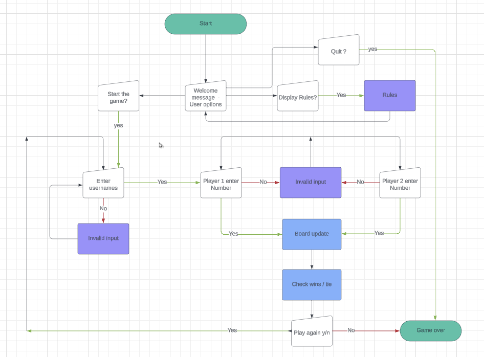

# Tic-Tac-Toe Game

Welcome to Tic-Tac-Toe Game ! It is a Python terminal game , which runs in Code Institute mock terminal on Heroku. It allows two players to play the classic game of Tic Tac Toe. Players can enter their usernames, where one will be assigned the symbol 'X' and the other 'O'. The program also provides warnings if the input is invalid.

The  live version of my project can be found under the following link [Tic Tac Toe](https://tic-tac-toe-2024-ec215a152e15.herokuapp.com/).

## How to Play
 + Run the Python script by clicking on 'Run the programm" button.
 + Enter the usernames for both players.
 + Follow the prompts to input your moves.
 + The game will display the current state of the board after each move.
 + If a player wins, the game will announce the winner, or a tie.
 + After the game ends, players can choose to play again or exit.

## Existing Features
  + Two-player gameplay.
  + Players must input their usernames.

   

  + Assignment of 'X' and 'O' symbols to players.

  
 
  + Updating the board accordingly on players input.

  

  + Input validation and error checking.
    + User must enter numbers 
    + User can not enter the same position (number) twice.

+ Game end promts the user to enter y/n for play again or exit the game.
+ User must enter 'y' or 'n' otherwise error message is displayed.

## Features left to implement
  + Graphic Design
     + Design custom symbols for 'X' and 'O'
     + Develop a user-friendly graphical interface using a Python GUI library such as Tkinter or Kivy.

## Data Model

 + The board represents the current configuration of the Tic Tac Toe game board.
 + It can be represented as a list or array containing nine elements (numbers), each corresponding to a cell on the 3x3 grid.
 + Each cell can have one of three values: 'X' (Player 1), 'O' (Player 2), or '1-9 ' (Number).

## Flowchart

## Technology Used
 + Python 3.0
 + GitHub , Gitpod
 + Heroku

### Libraries
 + os - Miscellaneous operating system interfaces

## Testing

Manually tested this project by doing the following:
+ Passed the code through PEP8 linter and confirmed there are no issues.
+ Invalid inputs: strings when numbers are expected ,out of bound inputs, same input twice
+ Tested in my local terminal and the Code Institute Heroku Terminal

### Bugs

#### Solved bugs
 + When I wrote the `user_input` function code, the invalid inputs warning messages were not displaying. I fixed this by re-arranging the function and removing the  `os.system('cls' if os.name == 'nt' else 'clear')` from inside of While loop and placing it outside of the loop. This adjustment allowed for the display of warning messages for invalid inputs.

 + On game ending , if user entered anything else instead of y/n , the game was exiting completely. I resolved this by adding `def play_again():` function and by calling it after main function is executed.

 #### Remaining Bugs

  + No bugs remaining

### Validator Testing

 + PEP8
   + No errors were returned from PEP8 validator.

## Deployment

### Creating the Heroku app

When I created the app, I added two buildpacks from the _Settings_ tab. The ordering is as follows:

1. `heroku/python`
2. `heroku/nodejs`
3. Created a _Config Var_ called `PORT`and set this to `8000`

Connected to my GitHub repository and deployed the project.

This project was deployed using Code Institute's mock terminal for Heroku.

 + Steps for deployment:

   + Create a new Heroku app
   + Set the buildbacks to `Python` and `Node.js` in that order
   + Link the Heroku app to the repository
   + Click on Deploy

## Credits

 + Code Institute for the deployment terminal and deployment section in this document.
 + Flowchart is created with https://lucid.co/ .
 + Solution for not re-displaying the board again but instead updating on correct input by using`import os` [Official Python documentation](https://docs.python.org/3/library/os.html) and [Tutorial for building a python project](https://www.youtube.com/watch?v=Q6CCdCBVypg). Please note, the approach itself is different.

Enjoy the game !
